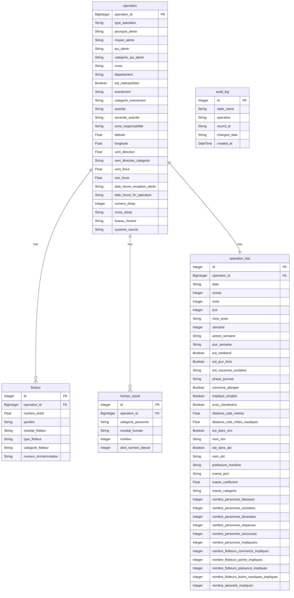

# CRUD_CROSS

FastAPI + SQLAlchemy CRUD application for maritime rescue operations data (CROSS).

## Stack

- **FastAPI** — REST API
- **SQLAlchemy 2.0** + **psycopg2** — ORM + PostgreSQL driver
- **Alembic** — database migrations
- **Pydantic v2** — request/response schemas
- **pytest + pytest-cov** — testing & coverage
- **Docker** — PostgreSQL 16

## Database Schema



## Getting Started

### 1. Start the database

```bash
docker compose up -d
```

### 2. Run the API

```bash
fastapi dev main_fastapi.py
```

### 3. Run migrations

```bash
alembic upgrade head
```

### 4. Run tests with coverage

```bash
python -m pytest tests/ -v
```

## API Endpoints

| Method | Route | Description |
|--------|-------|-------------|
| GET | `/operations/` | List all operations |
| POST | `/operations/` | Create an operation |
| GET | `/operations/{id}` | Get an operation |
| PUT | `/operations/{id}` | Update an operation |
| DELETE | `/operations/{id}` | Delete an operation |
| GET | `/flotteurs/` | List all flotteurs |
| POST | `/flotteurs/` | Create a flotteur |
| GET | `/flotteurs/{id}` | Get a flotteur |
| PUT | `/flotteurs/{id}` | Update a flotteur |
| DELETE | `/flotteurs/{id}` | Delete a flotteur |
| GET | `/humain-results/` | List all human results |
| POST | `/humain-results/` | Create a human result |
| GET | `/humain-results/{id}` | Get a human result |
| PUT | `/humain-results/{id}` | Update a human result |
| DELETE | `/humain-results/{id}` | Delete a human result |
| GET | `/operation-stats/` | List all operation stats |
| GET | `/operation-stats/{id}` | Get operation stats |
| POST | `/ingest/` | Ingest a full operation payload |
| GET | `/audit/` | List audit log entries |
| GET | `/audit/{id}` | Get an audit log entry |